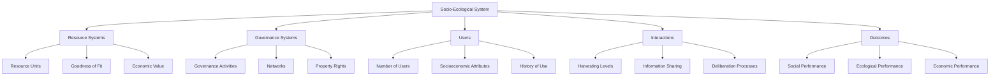
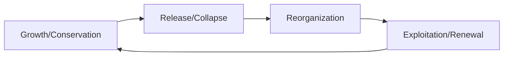

---

title: Social–Ecological Systems (SES)

type: systems

status: stable

tags: [SES, coupled_systems, sustainability]

semantic_relations:

  - type: relates

    links: [resilience_thinking, adaptive_comanagement, environmental_applications]

---

# Social–Ecological Systems (SES)

Social-Ecological Systems (SES) are complex, coupled systems that integrate human societies with natural ecosystems through reciprocal interactions and feedback loops. This framework provides a holistic approach to understanding and managing the dynamic interplay between social and ecological components, emphasizing sustainability, resilience, and adaptive governance.

## 🌍 Core Concepts

### System Coupling
SES are characterized by tight couplings between social and ecological subsystems:

- **Social Subsystem**: Human institutions, economies, cultures, and behaviors
- **Ecological Subsystem**: Natural processes, biodiversity, resource flows, and ecosystem services
- **Feedback Loops**: Bidirectional influences between social and ecological components
- **Scale Interactions**: Cross-scale dynamics from local to global levels

### Key Properties
- **Complexity**: Non-linear interactions and emergent behaviors
- **Uncertainty**: Inherent unpredictability in system responses
- **Adaptability**: Capacity for learning and transformation
- **Resilience**: Ability to absorb disturbance and reorganize

## 🏗️ SES Framework Components

### Social Components
- **Actors**: Individuals, communities, organizations, and institutions
- **Institutions**: Rules, norms, and governance structures
- **Knowledge Systems**: Local and scientific knowledge
- **Values and Beliefs**: Cultural and ethical frameworks
- **Economic Systems**: Markets, property rights, and resource allocation

### Ecological Components
- **Biophysical Structures**: Landscapes, habitats, and species assemblages
- **Processes**: Nutrient cycling, energy flows, and disturbance regimes
- **Ecosystem Services**: Provisioning, regulating, cultural, and supporting services
- **Biodiversity**: Genetic, species, and ecosystem diversity
- **Resource Stocks**: Renewable and non-renewable resources

### Interactions and Feedbacks
- **Resource Use**: Human exploitation of ecosystem services
- **Environmental Impact**: Social activities affecting ecological processes
- **Adaptation**: Social responses to environmental changes
- **Transformation**: Fundamental changes in system structure and function

## 📊 SES Analysis Frameworks

### Ostrom's SES Framework
Elinor Ostrom's framework provides a multi-tier diagnostic approach:

### Resilience Alliance Framework
Focuses on adaptive capacity and transformation:

- **Resilience**: Capacity to absorb disturbance and reorganize
- **Adaptability**: Capacity to learn and adjust responses
- **Transformability**: Capacity for fundamental system changes

### Integrated Assessment Frameworks
- **Ecosystem Services Assessment**: Valuation and mapping of ecosystem benefits
- **Vulnerability Assessment**: Analysis of system exposure and sensitivity
- **Scenario Planning**: Exploration of alternative future trajectories

## 🔄 SES Dynamics and Processes

### Adaptive Cycles
SES often exhibit adaptive cycle dynamics:

- **Exploitation**: Resource accumulation and system growth
- **Conservation**: System maturation and resource control
- **Release**: System breakdown and resource release
- **Reorganization**: Innovation and system renewal

### Cross-Scale Interactions
- **Panarchy**: Hierarchical organization of adaptive cycles
- **Scale Mismatches**: Misalignments between ecological and social scales
- **Teleconnections**: Long-distance interactions and global linkages

### Regime Shifts and Thresholds
- **Tipping Points**: Critical transitions between system states
- **Alternative Stable States**: Multiple equilibria in system dynamics
- **Early Warning Signals**: Indicators of impending regime shifts

## 🏛️ Governance and Management

### Adaptive Governance
- **Polycentric Governance**: Multiple centers of decision-making
- **Collaborative Management**: Stakeholder participation and knowledge integration
- **Learning Organizations**: Continuous monitoring and adaptation

### Institutional Arrangements
- **Property Rights**: Access and control over resources
- **Rules and Norms**: Formal and informal behavioral constraints
- **Monitoring Systems**: Performance tracking and feedback loops

### Policy Instruments
- **Regulatory Approaches**: Command-and-control regulations
- **Economic Incentives**: Market-based instruments and payments
- **Voluntary Measures**: Education and voluntary agreements

## 📈 Assessment and Monitoring

### Indicators and Metrics
- **Ecological Indicators**: Biodiversity, ecosystem health, resource stocks
- **Social Indicators**: Equity, well-being, institutional performance
- **Integrated Metrics**: Human-ecosystem well-being indices

### Participatory Approaches
- **Stakeholder Analysis**: Identification and engagement of affected parties
- **Knowledge Co-Production**: Integration of different knowledge systems
- **Scenario Development**: Collaborative future visioning

### Adaptive Management Cycle
1. **Assessment**: System characterization and problem definition
2. **Design**: Development of management alternatives
3. **Implementation**: Action and monitoring
4. **Evaluation**: Learning and adaptation
5. **Adjustment**: Modification of management approaches

## 🌱 Applications and Case Studies

### Forest Management
- **Community Forestry**: Local governance of forest resources
- **Adaptive Co-Management**: Collaborative forest restoration
- **Payment for Ecosystem Services**: Economic incentives for conservation

### Fisheries Management
- **Coastal Zone Management**: Integrated marine resource governance
- **Fisheries Co-Management**: Stakeholder participation in fisheries
- **Marine Protected Areas**: Spatial management of ocean resources

### Water Resource Management
- **Watershed Management**: Integrated river basin governance
- **Groundwater Management**: Sustainable aquifer use
- **Urban Water Systems**: City-scale water resource management

### Climate Change Adaptation
- **Vulnerability Assessment**: Analysis of climate impacts on SES
- **Adaptation Planning**: Development of climate-resilient strategies
- **Transformation Pathways**: Fundamental system changes for sustainability

## 🔬 Research Methods and Tools

### Modeling Approaches
- **System Dynamics**: Simulation of feedback loops and delays
- **Agent-Based Modeling**: Individual-level decision-making in SES
- **Network Analysis**: Social-ecological interaction networks
- **Bayesian Networks**: Uncertainty analysis and decision support

### Data Collection Methods
- **Remote Sensing**: Ecosystem monitoring and change detection
- **Social Surveys**: Stakeholder perceptions and values assessment
- **Participatory GIS**: Spatial analysis with local knowledge
- **Longitudinal Studies**: Temporal dynamics and trend analysis

### Analytical Frameworks
- **Institutional Analysis**: Examination of governance arrangements
- **Vulnerability Analysis**: Assessment of system exposure and coping capacity
- **Resilience Assessment**: Measurement of system robustness and adaptability

## 🎯 Challenges and Opportunities

### Key Challenges
- **Scale Mismatches**: Temporal and spatial scale misalignments
- **Uncertainty Management**: Dealing with incomplete knowledge and surprises
- **Equity and Justice**: Fair distribution of costs and benefits
- **Power Dynamics**: Unequal influence in decision-making processes
- **Institutional Barriers**: Resistance to change and path dependencies

### Emerging Opportunities
- **Digital Technologies**: Remote sensing, big data, and AI for monitoring
- **Indigenous Knowledge**: Integration of traditional ecological knowledge
- **Transdisciplinary Research**: Bridging natural and social sciences
- **Global Sustainability**: International cooperation for global challenges

## 🔗 Integration with Active Inference

### Predictive Processing in SES
- **Generative Models**: Mental models of social-ecological dynamics
- **Prediction Errors**: Surprises and discrepancies in system expectations
- **Model Updating**: Learning from environmental feedback
- **Policy Selection**: Decision-making under uncertainty

### Active Inference Applications
- **Adaptive Management**: Model-based decision-making with learning
- **Stakeholder Coordination**: Shared mental models and communication
- **Resilience Building**: Proactive adaptation to changing conditions
- **Sustainability Transitions**: Transformative changes toward sustainability

## 📚 References and Further Reading

### Key Publications
- **Ostrom (2009)**: Understanding Institutional Diversity
- **Folke et al. (2005)**: Adaptive Governance of Social-Ecological Systems
- **Berkes et al. (2003)**: Navigating Social-Ecological Systems

### Related Concepts
- [[resilience_thinking]] - Capacity to absorb disturbance and adapt
- [[adaptive_comanagement]] - Collaborative adaptive management approaches
- [[bioregional_stewardship_theory]] - Place-based governance and stewardship
- [[ecosystem_management]] - Ecosystem-level management strategies

