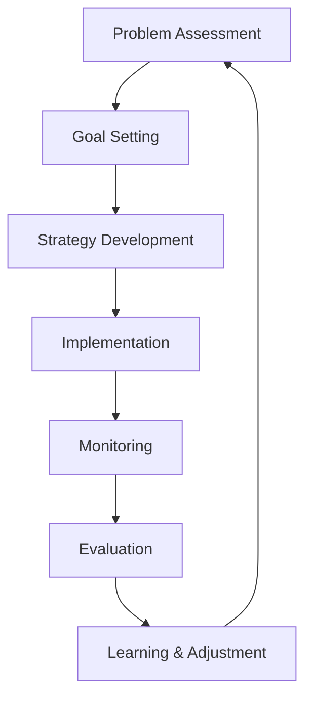

---

title: Adaptive Co-management

type: systems

status: stable

tags: [SES, governance, adaptation]

semantic_relations:

  - type: relates

    links: [resilience_thinking, ecosystem_management, learning_initiatives]

---

# Adaptive Co-management

Adaptive co-management integrates adaptive management principles with collaborative governance approaches to address the complex challenges of social-ecological systems (SES). This framework emphasizes iterative learning, stakeholder participation, power sharing, and institutional flexibility to manage uncertainty, change, and multiple objectives in coupled human-natural systems.

## 🤝 Core Principles

### Collaborative Governance
- **Stakeholder Participation**: Inclusive involvement of diverse actors
- **Power Sharing**: Distributed decision-making authority
- **Knowledge Integration**: Combining scientific and local knowledge
- **Trust Building**: Developing relationships and social capital

### Adaptive Management
- **Iterative Learning**: Continuous monitoring and adjustment cycles
- **Experimental Approaches**: Testing management interventions
- **Uncertainty Acceptance**: Embracing complexity and unpredictability
- **Resilience Focus**: Building system robustness and adaptability

### Integrated Approach
- **Social-Ecological Integration**: Bridging human and natural system management
- **Multi-Scale Coordination**: Linking local, regional, and higher-level governance
- **Long-Term Perspective**: Planning across extended time horizons
- **Equity Considerations**: Fair distribution of costs and benefits

## 🏗️ Framework Components

### Institutional Arrangements
- **Bridging Organizations**: Intermediary institutions facilitating collaboration
- **Nested Governance**: Hierarchical governance with local autonomy
- **Legal Frameworks**: Enabling legislation and regulatory support
- **Capacity Building**: Developing skills and resources for participants

### Knowledge Systems
- **Scientific Knowledge**: Research-based understanding and monitoring
- **Local/Traditional Knowledge**: Place-based experience and wisdom
- **Joint Fact-Finding**: Collaborative knowledge production
- **Learning Platforms**: Mechanisms for sharing and integrating knowledge

### Decision-Making Processes
- **Collaborative Planning**: Joint development of management strategies
- **Conflict Resolution**: Mechanisms for addressing disagreements
- **Consensus Building**: Developing shared understanding and agreement
- **Adaptive Implementation**: Flexible execution with monitoring and adjustment

## 🔄 Adaptive Management Cycle

### Learning Loop Structure

### Key Phases

#### Assessment Phase
- **System Characterization**: Understanding social-ecological context
- **Stakeholder Analysis**: Identifying actors and interests
- **Knowledge Inventory**: Assessing available information and gaps
- **Goal Formulation**: Developing shared objectives

#### Design Phase
- **Strategy Development**: Creating management alternatives
- **Monitoring Design**: Establishing indicators and methods
- **Institutional Design**: Developing governance arrangements
- **Capacity Assessment**: Evaluating implementation capacity

#### Implementation Phase
- **Action Planning**: Detailed implementation strategies
- **Resource Mobilization**: Securing necessary resources
- **Communication**: Stakeholder engagement and information sharing
- **Piloting**: Testing approaches on smaller scales

#### Monitoring and Evaluation
- **Indicator Tracking**: Regular measurement of key variables
- **Participatory Evaluation**: Stakeholder involvement in assessment
- **Adaptive Adjustment**: Modifying strategies based on results
- **Knowledge Generation**: Learning from implementation experience

## 🎯 Applications and Case Studies

### Forest Management
- **Canadian Model Forests**: Large-scale collaborative forest governance
- **Community Forestry**: Local control of forest resources and benefits
- **Cross-Boundary Management**: Coordination across property boundaries
- **Indigenous Co-Management**: Integration of traditional and scientific approaches

### Fisheries Management
- **Coastal Fisheries**: Community-based marine resource management
- **Inland Fisheries**: Watershed-scale fish population management
- **Transboundary Fisheries**: International cooperation on shared stocks
- **Aboriginal Fisheries**: Indigenous rights and stewardship integration

### Watershed Management
- **River Basin Councils**: Integrated watershed governance
- **Groundwater Management**: Aquifer protection and allocation
- **Urban Watersheds**: Managing water in urbanized landscapes
- **Agricultural Watersheds**: Balancing farming and water quality

### Protected Area Management
- **Biosphere Reserves**: UNESCO's Man and Biosphere program
- **Marine Protected Areas**: Ocean conservation with stakeholder involvement
- **National Parks**: Balancing conservation and community needs
- **Indigenous Protected Areas**: Aboriginal-led conservation territories

## 🛠️ Tools and Methods

### Participatory Methods
- **Stakeholder Mapping**: Identifying and characterizing participants
- **Visioning Exercises**: Developing shared future scenarios
- **Scenario Planning**: Exploring alternative management trajectories
- **Deliberation Forums**: Structured discussions and decision-making

### Knowledge Integration
- **Joint Fact-Finding**: Collaborative data collection and analysis
- **Knowledge Co-Production**: Creating new knowledge through collaboration
- **Traditional Knowledge Documentation**: Recording and integrating indigenous knowledge
- **Participatory GIS**: Spatial analysis with community input

### Monitoring Approaches
- **Participatory Monitoring**: Community-based data collection
- **Indicator Development**: Creating meaningful performance measures
- **Adaptive Monitoring**: Flexible monitoring designs
- **Real-Time Feedback**: Rapid assessment and response systems

### Conflict Resolution
- **Mediation Processes**: Facilitated negotiation of disputes
- **Interest-Based Bargaining**: Focusing on underlying needs
- **Collaborative Learning**: Building understanding through dialogue
- **Power Analysis**: Addressing imbalances in decision-making

## 📊 Success Factors and Challenges

### Success Factors
- **Leadership**: Effective facilitation and bridging organizations
- **Trust Building**: Developing relationships and social capital
- **Capacity Development**: Building skills and resources
- **Institutional Support**: Enabling policies and legal frameworks
- **Monitoring Systems**: Effective tracking and learning mechanisms
- **Scalability**: Ability to work across different scales
- **Equity**: Fair representation and benefit distribution

### Common Challenges
- **Power Imbalances**: Unequal influence among stakeholders
- **Resource Constraints**: Limited funding and capacity
- **Institutional Barriers**: Rigid governance structures
- **Knowledge Gaps**: Incomplete understanding of systems
- **Conflict Escalation**: Unresolved disputes hindering progress
- **Scale Mismatches**: Misalignment between governance and ecological scales
- **Sustainability**: Maintaining momentum over long time periods

### Mitigation Strategies
- **Inclusive Design**: Ensuring broad participation from the start
- **Capacity Building**: Investing in skills and resources
- **Flexible Institutions**: Adaptable governance arrangements
- **Conflict Management**: Proactive dispute resolution mechanisms
- **Knowledge Brokering**: Facilitating information exchange
- **Adaptive Planning**: Building in flexibility for changing conditions

## 🔬 Research and Evaluation

### Evaluation Frameworks
- **Process Evaluation**: Assessing implementation quality
- **Outcome Evaluation**: Measuring environmental and social results
- **Impact Assessment**: Understanding broader system effects
- **Sustainability Analysis**: Assessing long-term viability

### Research Methods
- **Case Study Analysis**: In-depth examination of specific initiatives
- **Comparative Studies**: Cross-case analysis of different approaches
- **Longitudinal Research**: Tracking changes over extended periods
- **Participatory Research**: Community involvement in research design

### Theoretical Development
- **Institutional Analysis**: Understanding governance arrangements
- **Social Learning Theory**: Examining learning processes
- **Resilience Theory**: Building system robustness
- **Complexity Theory**: Understanding emergent system behaviors

## 🌍 Global Applications

### Developing Countries
- **Community-Based Natural Resource Management**: Local control in developing contexts
- **Decentralization Reforms**: Shifting authority to local levels
- **Poverty Alleviation**: Linking conservation with livelihood improvement
- **Climate Adaptation**: Building resilience to environmental change

### Developed Countries
- **Environmental Governance**: Managing complex environmental issues
- **Indigenous Rights**: Integrating traditional governance systems
- **Urban Sustainability**: Managing urban social-ecological systems
- **Climate Change Response**: Adaptive strategies for global change

### International Cooperation
- **Transboundary Resources**: Managing shared ecosystems across borders
- **Global Environmental Agreements**: International environmental governance
- **Development Cooperation**: Aid effectiveness and local participation
- **Climate Finance**: Equitable distribution of adaptation resources

## 🔗 Integration with Broader Frameworks

### Social-Ecological Systems
- **Governance Component**: Providing institutional frameworks for SES
- **Adaptive Capacity**: Building learning and flexibility in SES
- **Scale Bridging**: Connecting local action with broader system dynamics
- **Knowledge Integration**: Combining multiple knowledge systems

### Resilience Thinking
- **Adaptive Governance**: Governance that supports resilience
- **Transformability**: Capacity for fundamental system changes
- **Cross-Scale Dynamics**: Managing interactions across scales
- **Learning Cycles**: Continuous adaptation and improvement

### Active Inference Applications
- **Collaborative Learning**: Shared mental model development
- **Adaptive Governance**: Model-based decision-making with learning
- **Stakeholder Coordination**: Aligning diverse perspectives
- **Uncertainty Management**: Dealing with complex system uncertainties

## 📚 Key References

### Foundational Works
- **Armitage et al. (2009)**: Adaptive co-management for social-ecological complexity
- **Carlsson and Berkes (2005)**: Co-management: concepts and methodological implications
- **Folke et al. (2005)**: Adaptive governance of social-ecological systems

### Case Studies
- **Berkes (2009)**: Community-based conservation in a globalized world
- **Pinkerton (1989)**: Co-operative management of local fisheries
- **Plummer and FitzGibbon (2004)**: Some observations on the terminology in co-operative environmental management

### Theoretical Developments
- **Ostrom (1990)**: Governing the commons
- **Holling (1978)**: Adaptive environmental assessment and management
- **Lee (1993)**: Compass and gyroscope

### Related Concepts
- [[resilience_thinking]] - Building system resilience and adaptability
- [[Social-Ecological Systems]] - Coupled human-natural systems
- [[ecosystem_management]] - Ecosystem-level management approaches
- [[learning_initiatives]] - Knowledge building and capacity development

