---

title: Resilience Thinking

type: systems

status: stable

tags: [resilience, SES, adaptability]

semantic_relations:

  - type: relates

    links: [adaptive_comanagement, ecosystem_management, traditional_ecological_knowledge]

---

# Resilience Thinking

Resilience thinking provides a framework for understanding how complex systems respond to disturbances, adapt to change, and maintain functionality across multiple scales. It emphasizes the capacity of systems to absorb shocks, reorganize when necessary, and persist or transform in the face of uncertainty. This approach shifts focus from equilibrium and prediction to adaptability, learning, and transformation.

## 🌊 Core Concepts

### Resilience Definitions

#### Engineering Resilience
- **Recovery Time**: How quickly a system returns to equilibrium after disturbance
- **Stability Focus**: Maintaining system state and resisting change
- **Efficiency Emphasis**: Optimizing for stability and predictability
- **Equilibrium Assumption**: Systems tend toward stable states

#### Ecological Resilience
- **Absorptive Capacity**: Amount of disturbance a system can withstand
- **Adaptive Capacity**: Ability to learn and reorganize in response to change
- **Transformative Capacity**: Fundamental reorganization when needed
- **Multiple Equilibria**: Systems may have alternative stable states

#### Social-Ecological Resilience
- **Interconnected Systems**: Integration of social and ecological components
- **Cross-Scale Dynamics**: Interactions across temporal and spatial scales
- **Learning and Adaptation**: Continuous knowledge building and adjustment
- **Transformability**: Capacity for fundamental system changes

### Key Resilience Properties

#### Absorptive Capacity
- **Buffer Capacity**: Ability to absorb disturbances without changing structure
- **Withstand Shocks**: Maintaining function during perturbations
- **Resistance**: Ability to avoid displacement by disturbance
- **Latitude**: Range of variability within which system can operate

#### Adaptive Capacity
- **Learning**: Ability to acquire and apply new knowledge
- **Self-Organization**: Spontaneous emergence of new structures
- **Innovation**: Development of novel responses to challenges
- **Flexibility**: Ability to change strategies and behaviors

#### Transformative Capacity
- **Reorganization**: Fundamental restructuring when needed
- **Innovation**: Development of new system configurations
- **Threshold Crossing**: Moving between alternative stable states
- **Adaptive Cycles**: Periodic reorganization and renewal

## 🔄 Adaptive Cycles and Panarchy

### Adaptive Cycle Model

```mermaid
graph TD
    A[Rapid Growth<br/>Exploitation<br/>r-Strategy] --> B[Conservation<br/>Accumulation<br/>K-Strategy]
    B --> C[Release<br/>Creative Destruction<br/>Ω-Phase]
    C --> D[Reorganization<br/>Innovation<br/>α-Phase]
    D --> A

    style A fill:#e1f5fe
    style B fill:#fff3e0
    style C fill:#ffebee
    style D fill:#e8f5e8
```

### Cycle Phases

#### Exploitation (r) Phase
- **Rapid Growth**: Resource accumulation and system expansion
- **Opportunity Capture**: Taking advantage of available resources
- **Colonization**: Filling ecological or social niches
- **Frontier Dynamics**: Pioneer species or innovative actors

#### Conservation (K) Phase
- **Resource Control**: Accumulation and storage of capital
- **Efficiency Optimization**: Fine-tuning system processes
- **Competitive Exclusion**: Specialization and optimization
- **Vulnerability Buildup**: Increasing rigidity and sensitivity

#### Release (Ω) Phase
- **Disruption**: Breaking down accumulated structures
- **Resource Liberation**: Release of stored capital
- **Creative Destruction**: Opening space for new possibilities
- **Uncertainty Increase**: Heightened unpredictability

#### Reorganization (α) Phase
- **Innovation**: Emergence of new structures and possibilities
- **Experimentation**: Testing new configurations
- **Reconnection**: Rebuilding system linkages
- **Diversity Increase**: Opening of new opportunities

### Panarchy Framework
- **Nested Hierarchies**: Adaptive cycles operating at different scales
- **Cross-Scale Interactions**: Influences between different scale levels
- **Revolt**: Small-scale changes triggering large-scale reorganization
- **Remember**: Large-scale constraints influencing small-scale dynamics

## ⚖️ Stability and Change

### Stability Landscapes

### Alternative Stable States
- **Multiple Attractors**: Different stable configurations possible
- **Hysteresis**: Path dependence in state transitions
- **Basins of Attraction**: Regions of stability in state space
- **Thresholds**: Critical points triggering state changes

### Regime Shifts
- **Abrupt Transitions**: Rapid changes between stable states
- **Early Warning Signals**: Indicators of impending shifts
- **Tipping Points**: Critical thresholds for system change
- **Recovery Potential**: Ability to return to previous state

## 🧬 Biodiversity and Redundancy

### Response Diversity
- **Multiple Pathways**: Different ways to achieve same function
- **Functional Redundancy**: Overlap in species or actor capabilities
- **Response Diversity**: Variation in responses to environmental change
- **Portfolio Effect**: Risk spreading through diversity

### Biodiversity-Ecosystem Function
- **Insurance Hypothesis**: Diversity provides resilience to disturbance
- **Portfolio Effect**: Asynchronous responses reduce variability
- **Sampling Effect**: Higher probability of including effective species
- **Complementarity**: Niche differentiation enhances function

### Social Diversity
- **Knowledge Diversity**: Multiple knowledge systems and perspectives
- **Institutional Diversity**: Variety of governance arrangements
- **Economic Diversity**: Multiple livelihood strategies
- **Cultural Diversity**: Different values and worldviews

## 🔗 Connectivity and Modularity

### Network Structures
- **Small-World Networks**: High clustering with short path lengths
- **Scale-Free Networks**: Power-law degree distributions
- **Modular Networks**: Communities with internal density
- **Hierarchical Networks**: Nested organizational structures

### Connectivity Trade-offs
- **Too Connected**: Rapid disturbance propagation, reduced independence
- **Too Isolated**: Reduced information flow, increased vulnerability
- **Optimal Connectivity**: Balance between integration and autonomy
- **Adaptive Connectivity**: Changing connections based on context

### Modularity Benefits
- **Failure Containment**: Limiting disturbance spread
- **Innovation Spaces**: Protected areas for experimentation
- **Specialization**: Development of specialized functions
- **Adaptation**: Differential responses to change

## 📊 Monitoring and Assessment

### Resilience Indicators
- **Diversity Metrics**: Species, institutional, and response diversity
- **Connectivity Measures**: Network structure and information flow
- **Adaptive Capacity**: Learning rates and innovation capacity
- **Transformability**: Reorganization potential and flexibility

### Early Warning Signals
- **Critical Slowing Down**: Increased recovery times near thresholds
- **Increased Variance**: Growing variability before transitions
- **Spatial Correlation**: Synchronized behavior indicating instability
- **Recovery Rate**: Slower return to equilibrium

### Assessment Frameworks
- **Resilience Alliance Framework**: Three properties assessment
- **Vulnerability-Scoping Diagram**: Cross-scale resilience analysis
- **Safe Operating Spaces**: Planetary boundary frameworks
- **Adaptive Cycle Assessment**: Phase-specific indicators

## 🎯 Applications

### Ecosystem Management
- **Protected Area Design**: Connectivity and buffer zones
- **Fisheries Management**: Avoiding tipping points in fish stocks
- **Forest Management**: Managing disturbance regimes and succession
- **Wetland Restoration**: Building resilience to climate change

### Climate Change Adaptation
- **Vulnerability Assessment**: Identifying sensitive systems
- **Adaptation Planning**: Building adaptive capacity
- **Transformation Strategies**: Managing unavoidable changes
- **Equity Considerations**: Fair distribution of adaptation burdens

### Disaster Risk Reduction
- **Disaster Preparedness**: Building absorptive capacity
- **Recovery Planning**: Enhancing reorganization potential
- **Learning Systems**: Post-disaster improvement cycles
- **Community Resilience**: Social-ecological disaster response

### Business and Organizations
- **Organizational Resilience**: Adapting to market changes
- **Innovation Management**: Balancing exploration and exploitation
- **Supply Chain Resilience**: Managing disruption risks
- **Corporate Adaptation**: Transforming in response to change

## 🔬 Research Frontiers

### Theoretical Developments
- **General Resilience Theory**: Universal principles across domains
- **Quantum Resilience**: Quantum-inspired resilience concepts
- **Network Resilience**: Complex network perspectives
- **Cultural Resilience**: Social and psychological dimensions

### Methodological Advances
- **Big Data Analytics**: Large-scale resilience monitoring
- **Machine Learning**: Pattern recognition in complex systems
- **Participatory Modeling**: Stakeholder involvement in resilience assessment
- **Scenario Analysis**: Exploring future resilience challenges

### Interdisciplinary Integration
- **Neuroscience**: Brain resilience and cognitive flexibility
- **Psychology**: Individual and community resilience
- **Economics**: Economic system resilience and transformation
- **Political Science**: Governance resilience and institutional adaptation

## 🌍 Global Challenges

### Planetary Boundaries
- **Climate Change**: Managing global temperature thresholds
- **Biodiversity Loss**: Maintaining ecosystem function diversity
- **Nutrient Cycles**: Avoiding biogeochemical tipping points
- **Land Use Change**: Sustainable land system transformation

### Urban Resilience
- **City Systems**: Managing urban social-ecological complexity
- **Infrastructure Resilience**: Critical system protection and recovery
- **Social Cohesion**: Maintaining community bonds during stress
- **Economic Resilience**: Urban economic system adaptability

### Global Governance
- **International Cooperation**: Managing global commons
- **Equity and Justice**: Fair distribution of resilience burdens
- **Knowledge Sharing**: Global learning and adaptation networks
- **Institutional Innovation**: Novel governance arrangements

## 🔗 Integration with Active Inference

### Predictive Resilience
- **Anticipatory Governance**: Predicting and preventing regime shifts
- **Adaptive Learning**: Continuous model updating and improvement
- **Uncertainty Management**: Dealing with deep uncertainty in complex systems
- **Multi-Stakeholder Coordination**: Shared mental models of system dynamics

### Active Inference Applications
- **Resilience Monitoring**: Real-time assessment of system states
- **Adaptive Management**: Model-based decision-making with learning
- **Transformation Planning**: Managing fundamental system changes
- **Stakeholder Alignment**: Coordinating diverse interests and knowledge

## 📚 Key References

### Foundational Works
- **Holling (1973)**: Resilience and stability of ecological systems
- **Gunderson and Holling (2002)**: Panarchy: Understanding transformations in human and natural systems
- **Walker and Salt (2006)**: Resilience thinking: Sustaining ecosystems and people in a changing world
- **Folke et al. (2010)**: Resilience thinking: Integrating resilience, adaptability and transformability

### Theoretical Developments
- **Carpenter et al. (2001)**: From metaphor to measurement: Resilience of what to what?
- **Adger (2000)**: Social and ecological resilience: Are they related?
- **Brand and Jax (2007)**: Focusing the meaning(s) of resilience: Resilience as a descriptive concept and a boundary object

### Applications
- **Berkes et al. (2003)**: Navigating social-ecological systems: Building resilience for complexity and change
- **Levin (1999)**: Fragile dominion: Complexity and the commons
- **Scheffer (2009)**: Critical transitions in nature and society

### Related Concepts
- [[adaptive_comanagement]] - Collaborative adaptive management
- [[Social-Ecological Systems]] - Coupled human-natural systems
- [[ecosystem_management]] - Ecosystem-level management approaches
- [[learning_initiatives]] - Knowledge building and adaptation

