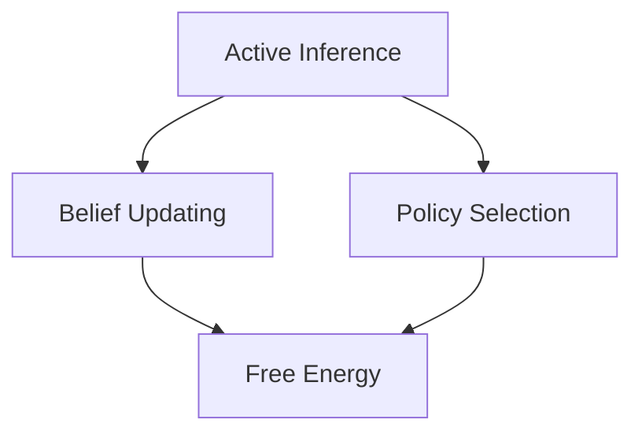

# Project Structure

## Overview

This document outlines the comprehensive organization of the cognitive modeling framework, detailing the purpose and relationships between different components.

## Core Directories

### 📁 knowledge_base/
Core knowledge organization and theoretical foundations

#### Cognitive Domain
- `cognitive/` - Core cognitive concepts
  - `active_inference/` - Active Inference framework
  - `belief_updating/` - Belief update mechanisms
  - `policy_selection/` - Action selection algorithms
  - `free_energy/` - Free Energy calculations
  - `predictive_processing/` - Predictive processing theory

#### Mathematical Domain
- `mathematics/` - Mathematical foundations
  - `probability/` - Probability theory
  - `information_theory/` - Information theoretic concepts
  - `optimization/` - Optimization methods
  - `dynamical_systems/` - System dynamics

#### Biological Domain
- `biology/` - Biological foundations
  - `neuroscience/` - Neuroscience concepts
  - `evolution/` - Evolutionary theory
  - `systems_biology/` - Systems biology principles

#### Philosophical Domain
- `philosophy/` - Philosophical foundations
  - `epistemology/` - Theory of knowledge
  - `metaphysics/` - Nature of reality
  - `philosophy_of_mind/` - Mind theories

#### Ontological Domain
- `ontology/` - Knowledge organization
  - `taxonomies/` - Classification systems
  - `semantic_networks/` - Concept relationships
  - `knowledge_graphs/` - Knowledge representation

#### Agent Domain
- `agents/` - Agent architectures
  - `multi_agent/` - Multi-agent systems
  - `agent_society/` - Agent social structures
  - `cognitive_agents/` - Cognitive agent designs

#### Citations
- `citations/` - Research references
  - `papers/` - Academic papers
  - `books/` - Reference books
  - `resources/` - Online resources

#### BioFirm
- `BioFirm/` - Biological firm theory
  - `models/` - BioFirm models
  - `analysis/` - BioFirm analysis

### 📁 tools/
Implementation code and utilities

#### Source Code
- `src/` - Source code implementation
  - `models/` - Core modeling components
    - `active_inference/` - Active Inference implementation
    - `belief_models/` - Belief representation
    - `policy_models/` - Policy implementation
  - `analysis/` - Analysis tools
    - `metrics/` - Performance metrics
    - `network_analysis/` - Network analysis
    - `simulations/` - Simulation frameworks
  - `visualization/` - Visualization tools
    - `state_space/` - State space visualization
    - `belief_plots/` - Belief visualization
    - `network_viz/` - Network visualization
  - `utils/` - Utility functions
    - `validation/` - Validation utilities
    - `data_processing/` - Data handling
    - `math_utils/` - Mathematical utilities

### 📁 tests/
Comprehensive test suite

#### Test Categories
- `unit/` - Unit tests
  - `test_matrix_ops.py`
  - `test_belief_updates.py`
  - `test_policy_selection.py`
- `integration/` - Integration tests
  - `test_agent_environment.py`
  - `test_learning_scenarios.py`
- `visualization/` - Visualization tests
  - `test_state_plots.py`
  - `test_network_viz.py`

### 📁 docs/
Project documentation

#### Documentation Types
- `api/` - API documentation
  - `reference/` - API reference
  - `examples/` - API usage examples
- `implementation/` - Implementation details
  - `architecture/` - System architecture
  - `algorithms/` - Algorithm documentation
  - `data_structures/` - Data structure details
- `development/` - Development guides
  - `contributing/` - Contribution guidelines
  - `style_guide/` - Coding standards
  - `workflow/` - Development workflow
- `examples/` - Usage examples
  - `tutorials/` - Step-by-step guides
  - `notebooks/` - Jupyter notebooks
  - `case_studies/` - Applied examples
- `research/` - Research foundations
  - `papers/` - Research papers
  - `concepts/` - Theoretical concepts
  - `literature_reviews/` - Literature surveys
- `config/` - Configuration documentation
  - `settings/` - Settings reference
  - `environment/` - Environment setup
- `guides/` - User guides
  - `quickstart/` - Getting started guides
  - `advanced/` - Advanced usage
- `repo_docs/` - Repository documentation
  - `project_structure/` - Structure documentation
  - `contribution_workflow/` - Contribution process
- `templates/` - Documentation templates
  - `api_template.md` - API documentation template
  - `example_template.md` - Example template
  - `tutorial_template.md` - Tutorial template
- `tools/` - Tools documentation
  - `utilities/` - Utility documentation
  - `visualization/` - Visualization tools

### 📁 notebooks/
Jupyter notebooks for exploration and examples

#### Notebook Categories
- `tutorials/` - Tutorial notebooks
  - `introduction/` - Introductory tutorials
  - `advanced/` - Advanced concepts
- `experiments/` - Experimental notebooks
  - `simulations/` - Simulation experiments
  - `analysis/` - Data analysis
- `visualizations/` - Visualization notebooks
  - `interactive/` - Interactive visualizations
  - `static/` - Static visualizations

### 📁 .benchmarks/
Performance benchmarking

#### Benchmark Categories
- `performance/` - Performance tests
- `scalability/` - Scalability tests
- `comparison/` - Comparative benchmarks

### 📁 Output/
Generated outputs and results

#### Output Types
- `figures/` - Generated figures
- `data/` - Output data
- `reports/` - Generated reports

### 📁 .obsidian/
Obsidian vault configuration

#### Obsidian Config
- `plugins/` - Obsidian plugins
- `themes/` - Visual themes
- `templates/` - Note templates

### 📁 Things/
Implementation examples and specific cognitive model instances

#### Model Implementations
- `Generic_Thing/` - Generic cognitive model implementation
- `Simple_POMDP/` - Simple POMDP implementations
- `Generic_POMDP/` - Generic POMDP framework
- `Continuous_Generic/` - Continuous state space models
- `BioFirm/` - Biological firm simulations
- `Ant_Colony/` - Ant colony optimization models
- `Baseball_Game/` - Baseball game simulations
- `Path_Network/` - Path network optimization
- `ActiveInferenceInstitute/` - Active inference institute models
- `KG_Multi_Agent/` - Knowledge graph multi-agent systems

## Configuration Files

### Primary Configuration
- `config.yaml` - Main configuration file
- `.gitignore` - Git ignored files
- `LICENSE` - Project license
- `.coverage` - Test coverage data

### Documentation Files
- `DOCUMENTATION_ROADMAP.md` - Documentation planning and roadmap
- `InferAnt_Stream.md` - InferAnt stream documentation
- `docs/README.md` - Documentation overview

## File Organization

### Naming Conventions
- Use lowercase with underscores
- Include category prefixes
- Be descriptive and concise
- Use consistent extensions (.md, .py, .ipynb)

### File Structure
- Include header metadata
- Follow consistent organization
- Maintain clear dependencies
- Include proper documentation blocks

### Version Control
- Use meaningful commits
- Group related changes
- Track dependencies
- Maintain clean branches
- Follow gitflow workflow

## Development Workflow

### 1. Knowledge Development
1. Create concept documentation
2. Establish relationships
3. Validate theoretical consistency
4. Update dependencies
5. Link to relevant literature

### 2. Implementation
1. Write core functionality
2. Add unit tests
3. Create integration tests
4. Document API
5. Add example usage

### 3. Validation
1. Run test suite
2. Check coverage
3. Validate relationships
4. Review documentation
5. Perform code reviews

### 4. Deployment
1. Update version
2. Generate documentation
3. Create release notes
4. Deploy changes
5. Monitor performance

## Continuous Integration

### CI Pipeline
- Automated testing
- Code quality checks
- Documentation building
- Dependency validation

### CD Pipeline
- Automated deployment
- Release packaging
- Version tagging
- Changelog generation

## Quality Assurance

### Documentation Standards
- Complete API documentation
- Clear usage examples
- Comprehensive guides
- Up-to-date references
- Consistent formatting

### Testing Requirements
- High test coverage
- Integration testing
- Property-based tests
- Performance benchmarks
- Regression tests

### Code Quality
- Follow style guide
- Use type hints
- Write clear comments
- Maintain modularity
- Apply SOLID principles

## Data Management

### Data Sources
- External datasets
- Generated data
- Test data
- Validation sets

### Data Storage
- File formats
- Database schemas
- Data versioning
- Backup strategies

## Obsidian Integration

This repository is designed to work with Obsidian, a powerful knowledge management tool that enhances markdown with additional features.

### Wiki-Style Links

#### Internal Links
- Use double brackets for internal links: `[[filename]]`
- Link to specific sections: `[[filename#section]]`
- Use aliases for different display text: `[[filename|Display Text]]`
- Links work across the entire vault for easy navigation

#### Link Examples
- Link to a concept: `[[active_inference]]`
- Link to section: `[[free_energy#Variational Free Energy]]`
- Link with alias: `[[policy_selection|Action Selection Mechanisms]]`

### Mermaid Diagrams

Obsidian supports Mermaid diagrams for visual representations directly in markdown:

#### Diagram Types
- Flowcharts for processes
- Sequence diagrams for interactions
- Class diagrams for structure
- State diagrams for state machines
- Gantt charts for timelines

#### Syntax Example

#### Usage Guidelines
- Keep diagrams focused and readable
- Use consistent styling
- Add comments for complex sections
- Consider both light and dark themes

### Obsidian Features

#### Key Features
- Backlinks showing references to the current note
- Graph view for visualizing connections
- Templates for consistent note creation
- Daily notes for journaling progress
- Plugins for extended functionality

#### Best Practices
- Create consistent templates for different content types
- Use tags for additional categorization: #concept, #implementation
- Leverage dataview queries for dynamic content
- Create MOCs (Maps of Content) for navigation hubs
- Use consistent metadata in YAML frontmatter

## References

### Documentation
- Project style guide
- API documentation
- Testing guide
- Contribution guide

### Dependencies
- requirements.txt
- setup.py
- environment.yml
- Dockerfile
- pyproject.toml

### External Resources
- Literature references
- Related projects
- Community resources
- Learning materials 